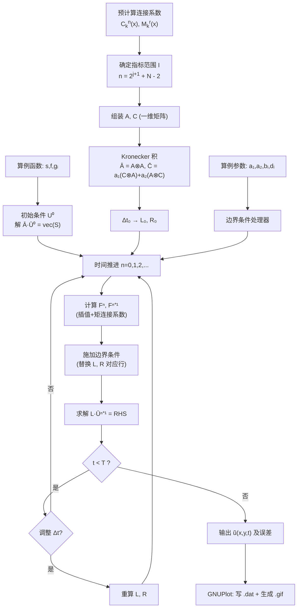
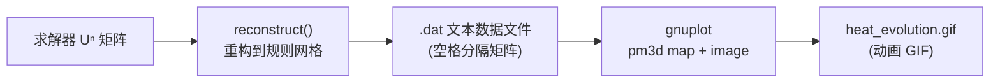

# WaveletFEM

基于**小波-Galerkin 方法（Wavelet-Galerkin Method）**求解二维非齐次热传导方程的有限元程序。支持变时间步长策略以抑制长时间积分的误差累积，并使用 GNUPlot 输出随时间演化的二维动态 GIF 可视化结果。

> 参考论文：Hashish H, Behiry S H, Elsaid A. *Solving the 2-D heat equations using wavelet-Galerkin method with variable time step* [J]. Applied Mathematics and Computation, 2009, 213: 209–215.

---

## 目录

- [1. 数学背景](#1-数学背景)
- [2. 详细算法流程](#2-详细算法流程)
- [3. 代码框架](#3-代码框架)
- [4. 依赖与安装](#4-依赖与安装)
- [5. 构建与运行](#5-构建与运行)
- [6. 输出与可视化](#6-输出与可视化)
- [7. 参考文献](#7-参考文献)

---

## 1. 数学背景

### 1.1 控制方程

在有限矩形区域 $\Omega = [a, b] \times [k, l]$ 上求解二维非齐次热传导方程：

$$a_1 \frac{\partial^2 u}{\partial x^2} + a_2 \frac{\partial^2 u}{\partial y^2} + f(x, y, t) = \frac{\partial u}{\partial t}, \quad 0 \leq t \leq T$$

**边界条件**（第三类 Robin 边界，每条边独立设置）：

$$b_i \frac{\partial u}{\partial n} + d_i u = g_i(x, y, t) \quad \text{on} \quad \partial\Omega_i,\; i = 1, 2, 3, 4$$

- 当 $d_i = 0$ 时退化为 **Neumann 边界**：$\frac{\partial u}{\partial n} = g_i / b_i$
- 当 $b_i = 0$ 时退化为 **Dirichlet 边界**：$u = g_i / d_i$

**初始条件**：

$$u(x, y, 0) = s(x, y), \quad \text{on} \quad \Omega$$

程序默认求解区域为 $\Omega = [0, 2] \times [0, 2]$。

### 1.2 Daubechies 小波基

选用 $N$ 阶 Daubechies 正交小波（消失矩为 $N$），其尺度函数 $\phi(x)$ 满足：

- **支撑集**：$\text{supp}(\phi) = [0,\; 2N-1]$
- **双尺度方程**：$\phi(x) = \sqrt{2} \sum_{k=0}^{2N-1} h_k\,\phi(2x - k)$
- **正交性**：$\int_{\mathbb{R}} \phi(x-k)\,\phi(x-l)\,dx = \delta_{k,l}$

通过张量积构造二维基函数：

$$\Phi_{j,k,i}(x, y) = \phi_{j,k}(x)\,\phi_{j,i}(y), \qquad \phi_{j,k}(x) = 2^{j/2}\,\phi(2^j x - k)$$

其中 $j > 0$ 为分辨率级别，$k, i$ 为平移指标。

### 1.3 小波-Galerkin 离散化

将近似解展开为第 $j$ 级小波级数：

$$\tilde{u}_j(x, y, t) = \sum_{k \in \mathcal{I}} \sum_{i \in \mathcal{I}} u_{j,k,i}(t)\;\Phi_{j,k,i}(x, y)$$

代入控制方程并做 Galerkin 投影，利用 **Kronecker 积** 得到矩阵形式：

$$\left(\bar{A} - \frac{\Delta t}{2}\bar{C}\right) \bar{U}^{n+1} = \left(\bar{A} + \frac{\Delta t}{2}\bar{C}\right) \bar{U}^n + \frac{\Delta t}{2}\left(\bar{F}^{n+1} + \bar{F}^n\right)$$

其中：

| 符号 | 定义 | 说明 |
|------|------|------|
| $A$ | $\tilde{a}_{l,k} = \int \phi_{j,k}\,\phi_{j,l}\,dx$ | 一维质量矩阵（带状对称） |
| $C$ | $\tilde{c}_{l,k} = \int \phi_{j,k}''\,\phi_{j,l}\,dx$ | 一维刚度矩阵（带状对称） |
| $\bar{A}$ | $A \otimes A$ | Kronecker 质量矩阵 |
| $\bar{C}$ | $a_1(C \otimes A) + a_2(A \otimes C)$ | Kronecker 刚度矩阵 |
| $\bar{U}^n$ | $\text{vec}(U^n)$ | 第 $n$ 步系数向量（列拉直） |
| $\bar{F}^n$ | $\text{vec}(F^n)$ | 非齐次项 Galerkin 投影 |

### 1.4 变时间步长策略

该迭代格式的总误差 = **空间逼近误差** $+$ **时间离散误差** $+$ **舍入误差**。

- 时间离散误差 $\propto \Delta t^2 \cdot \max\|u_t\|$
- 使用固定小步长时，迭代步数过多 → 舍入误差累积 → 解在后期**爆炸（blow-up）**

**策略**：采用单调不减的时间步长序列 $\Delta t_0 \leq \Delta t_1 \leq \Delta t_2 \leq \cdots$：
- **早期**（$t$ 小，解变化剧烈）：使用小步长捕捉瞬态行为
- **后期**（$t$ 大，解趋于稳态，$\|u_t\| \to 0$）：使用大步长减少迭代次数

---

## 2. 详细算法流程

以下流程针对区域 $\Omega = [0, 2] \times [0, 2]$，$N$ 阶 Daubechies 小波，分辨率级别 $j$。

### 第零步：连接系数预计算（一次性，与算例无关）

**两-term 连接系数** $C_k^n(x)$：

$$C_k^n(x) = \int_0^x \phi^{(n)}(y-k)\,\phi(y)\,dy$$

其中 $n=0$ 对应质量型（无导数），$n=2$ 对应刚度型（二阶导数）。指标范围 $k \in [-(2N-2),\; 2N-2]$。计算采用 Chen, Hwang, Shih (1996) 的算法：利用双尺度方程将问题转化为线性方程组。

**矩连接系数** $M_k^r(x)$：

$$M_k^r(x) = \int_0^x y^r\,\phi(y-k)\,dy$$

其中 $r = 0, 1, 2, \dots, R$（$R$ 取决于插值多项式的最高次数），用于处理非齐次项和边界函数的积分。计算采用 Behiry, Hashish, Gomaa (2001) 的快速算法。

### 第一步：确定基函数指标范围

对于区域 $[0, 2]$，尺度函数 $\phi_{j,k}$ 的支撑集需与区域相交，得指标集：

$$\mathcal{I} = \{-N+2,\; -N+3,\; \dots,\; 2^{\,j+1}-1\}$$

记 $n = |\mathcal{I}| = 2^{j+1} + N - 2$。二维基函数总数为 $n^2$。待求系数排为 $n \times n$ 矩阵 $U(t) = [u_{j,k,i}(t)]$。

### 第二步：组装一维矩阵

由于 $x$ 和 $y$ 方向区域相同，两个方向的矩阵**只需各计算一次**。

**质量矩阵** $A = [\tilde{a}_{l,k}]$：

$$\tilde{a}_{l,k} = \int_0^2 \phi_{j,k}(x)\,\phi_{j,l}(x)\,dx = C_{k-l}^0(2^{j+1} - l) - C_{k-l}^0(-l)$$

**刚度矩阵** $C = [\tilde{c}_{l,k}]$：

$$\tilde{c}_{l,k} = \int_0^2 \phi_{j,k}''(x)\,\phi_{j,l}(x)\,dx = C_{k-l}^2(2^{j+1} - l) - C_{k-l}^2(-l)$$

矩阵 $A$ 和 $C$ 对称正定且为**带状**（带宽约 $4N-3$）。

### 第三步：构造 Kronecker 积系统矩阵

$$\bar{A} = A \otimes A \quad\in \mathbb{R}^{n^2 \times n^2}$$

$$\bar{C} = a_1 (C \otimes A) + a_2 (A \otimes C) \quad\in \mathbb{R}^{n^2 \times n^2}$$

对每个时间步长 $\Delta t$ 构造 Crank-Nicolson 算子：

$$L = \bar{A} - \frac{\Delta t}{2}\,\bar{C}, \qquad R = \bar{A} + \frac{\Delta t}{2}\,\bar{C}$$

> 固定步长时 $L$ 和 $R$ 仅需计算一次；变步长时每次改变 $\Delta t$ 需重新计算。

### 第四步：计算初始条件

对初始条件 $s(x,y)$ 做 Galerkin 投影：

$$\bar{A} \cdot \bar{U}^0 = \text{vec}(S), \qquad S = [s_{l,m}]$$

$$s_{l,m} = \int_0^2\!\!\int_0^2 s(x,y)\,\phi_{j,l}(x)\,\phi_{j,m}(y)\,dx\,dy$$

对 $s(x,y)$ 做多项式插值后，积分通过矩连接系数 $M_k^r$ 解析求值。

### 第五步：时间推进循环

对 $n = 0, 1, 2, \dots$ 直到 $t_n \geq T$：

#### 5.1 计算非齐次项投影

$$f_{l,m}(t) = \int_0^2\!\!\int_0^2 f(x,y,t)\,\phi_{j,l}(x)\,\phi_{j,m}(y)\,dx\,dy$$

分两种情况（均通过多项式插值 + 矩连接系数求积）：

- **$f$ 关于空间变量可分**：$f = f_t(t) \cdot f_x(x) \cdot f_y(y)$ → 分别一维插值
- **$f$ 不可分**：每步对 $f(x,y,t_n)$ 做二维插值

#### 5.2 施加边界条件

对四条边界分别处理。以 $x = 0$ 边（Robin 条件）为例：

边界条件：$-b_1 \frac{\partial u}{\partial x}(0,y,t) + d_1\,u(0,y,t) = g_1(y,t)$

**(a) 左端离散**：

$$\sum_{i} \bigl[-b_1\,\phi_{j,k_{\min}}'(0) + d_1\,\phi_{j,k_{\min}}(0)\bigr] \cdot \tilde{a}_{m,i} \cdot u_{j,k_{\min},i}(t), \quad k_{\min}=-N+2$$

**(b) 右端离散**：对 $g_1(y,t)$ 做多项式插值，积分用矩连接系数求值。

**(c) 替换操作**：在 $L \cdot \bar{U}^{n+1} = \text{RHS}$ 的系统中，将对应行替换为 (a) 的系数，右端替换为 (b) 的值。

其他三条边处理类似，区别仅在于法向符号和插值函数。角点按先 $x$ 边后 $y$ 边的顺序施加（后覆盖先）。

#### 5.3 求解

$$\text{RHS}^n = R \cdot \bar{U}^n + \frac{\Delta t}{2}(\bar{F}^{n+1} + \bar{F}^n)$$

$$L \cdot \bar{U}^{n+1} = \text{RHS}^n$$

将 $\bar{U}^{n+1}$ 重整为 $n \times n$ 矩阵 $U^{n+1}$ 供下一时间步使用。

### 第六步：变时间步长调整

根据解的行为，动态增加步长：

$$\Delta t_n \leq \Delta t_{n+1}$$

每次改变 $\Delta t$ 时重新计算 $L$ 和 $R$，其余流程与固定步长相同。

### 第七步：误差评估

重构近似解并计算 $L^2$ 相对误差（需已知精确解）：

$$\tilde{u}_j(x,y,t_n) = \sum_{k,i} u_{j,k,i}(t_n)\,\phi_{j,k}(x)\,\phi_{j,i}(y)$$

$$\text{相对误差} = \frac{\|\tilde{u}_j - u_{\text{exact}}\|_{L^2(\Omega)}}{\|u_{\text{exact}}\|_{L^2(\Omega)}}$$

### 完整流程图



---

## 3. 代码框架

### 3.1 目录结构

```
wavelet-fem/
├── CMakeLists.txt                 # CMake 构建配置
├── README.md                      # 本文件
├── LICENSE
├── external/                      # 第三方依赖
│   └── eigen-3.4.0/               # Eigen 头文件库（需手动下载）
├── src/                           # 源代码
│   ├── main.cpp                   # 入口：参数解析、算例选择、流程调度
│   ├── types.h                    # 全局类型定义 (Eigen 矩阵别名等)
│   ├── daubechies.h / .cpp        # Daubechies 滤波器系数生成
│   ├── connection_coeff.h / .cpp  # 连接系数 C_k^n(x) 与 M_k^r(x) 计算
│   ├── wavelet_fem.h / .cpp       # 核心求解器
│   ├── examples.h / .cpp          # 算例 1 & 2 的函数定义
│   └── gnuplot_output.h / .cpp    # GNUPlot 数据输出与 GIF 动画生成
├── results/                       # 计算结果输出目录
│   ├── step_0000.dat
│   ├── step_0001.dat
│   └── heat_evolution.gif
└── scripts/                       # 辅助脚本
    └── run_examples.ps1           # 批量运行算例
```

### 3.2 模块职责

#### `daubechies.h / .cpp`

```cpp
// 生成 N 阶 Daubechies 小波的滤波器系数 {h_k}，k = 0..2N-1
// N 的建议取值为 4, 6, 8, 10
std::vector<double> daubechies_filter_coefficients(int N);

// 利用双尺度方程和递推计算 phi(x) 和 phi'(x) 在整数点的值
// 供边界条件离散使用
void evaluate_scaling_function(int N, std::vector<double>& phi_ints,
                               std::vector<double>& dphi_ints);
```

#### `connection_coeff.h / .cpp`

```cpp
// 两-term 连接系数表（质量型和刚度型）
struct ConnectionTable {
    // C_k^n: 索引 (k, n) → 分段多项式系数
    // k ∈ [-(2N-2), 2N-2], n ∈ {0, 2}
    // 在任意 x 处的值通过查表 + 多项式求值得到
    double evaluate_C(int k, int n, double x) const;
    // 预计算，只需调用一次
    static ConnectionTable compute(int N, int max_resolution);
};

// 矩连接系数表
struct MomentTable {
    // M_k^r: 索引 (k, r) → 分段多项式系数
    // r ∈ [0, max_power]
    double evaluate_M(int k, int r, double x) const;
    static MomentTable compute(int N, int max_power);
};
```

#### `wavelet_fem.h / .cpp`

```cpp
struct ProblemConfig {
    // 区域
    double ax = 0.0, bx = 2.0;   // x ∈ [ax, bx]
    double ay = 0.0, by = 2.0;   // y ∈ [ay, by]
    // PDE 系数
    double a1 = 1.0, a2 = 1.0;   // 扩散系数
    // 边界条件系数（每条边独立）
    std::array<double, 4> b = {1, 1, 1, 1};
    std::array<double, 4> d = {1, 1, 1, 1};
    // 小波参数
    int N = 6;                   // Daubechies 阶数
    int j = 4;                   // 分辨率级别
    // 时间参数
    double T = 1.0;              // 终止时间
    double dt0 = 0.005;          // 初始步长
    bool variable_dt = true;     // 是否使用变步长
};

// 算例函数接口（std::function 或虚基类）
using ScalarFunction2D = std::function<double(double, double)>;
using ScalarFunction3D = std::function<double(double, double, double)>;

class WaveletFEMSolver {
public:
    explicit WaveletFEMSolver(const ProblemConfig& config);

    // 设置算例函数
    void set_initial_condition(ScalarFunction2D s);
    void set_source_term(ScalarFunction3D f);
    void set_boundary_functions(std::array<ScalarFunction3D, 4> g);

    // 执行求解，返回各时间步的系数矩阵
    std::vector<Eigen::MatrixXd> solve();

    // 重构近似解 u(x, y, t_n) 在给定点上的值
    double reconstruct(double x, double y, int step) const;

    // 获取网格信息（供 GNUPlot 输出使用）
    int num_basis() const { return n_; }
    double dx_viz() const { return (bx_ - ax_) / (nviz_ - 1); }

private:
    // 组装一维质量矩阵和刚度矩阵
    void assemble_1d_matrices();
    // 构造 Kronecker 积系统
    void build_kronecker_system(double dt);
    // 投影函数到基函数空间
    Eigen::MatrixXd project_2d(ScalarFunction2D func) const;
    Eigen::MatrixXd project_3d(ScalarFunction3D func, double t) const;
    // 施加边界条件
    void apply_boundary_conditions(Eigen::MatrixXd& L, Eigen::VectorXd& rhs,
                                   double t);
    // 时间推进
    void time_step(const Eigen::MatrixXd& L, const Eigen::MatrixXd& R,
                   const Eigen::VectorXd& U_curr, const Eigen::VectorXd& F_curr,
                   const Eigen::VectorXd& F_next, Eigen::VectorXd& U_next);
};
```

#### `examples.h / .cpp`

内置两个算例的精确参数和函数定义（见 [1.1 控制方程](#11-控制方程)）：

| | 例 1 | 例 2 |
|---|------|------|
| **边界类型** | Robin: $\frac{\partial u}{\partial n} + u = g$ | Neumann: $\frac{\partial u}{\partial n} = g$ |
| **精确解** | $u = e^{-2x}\sin\frac{\pi y}{2} \cdot \frac{t+1}{t+2}$ | $u = \exp\!\left(-\frac{(x+1)+(y+1)}{2t+1}\right)$ |
| **行为** | $x$ 方向指数衰减，$y$ 方向正弦振荡 | 二维指数衰减扩散 |
| **趋于稳态** | $u \to e^{-2x}\sin(\pi y/2)$ | $u \to 1$（均匀分布） |

#### `gnuplot_output.h / .cpp`

```cpp
// 单步输出：将重构解 u(x,y,t_n) 在规则网格上求值，写入纯文本 .dat 文件（空格分隔）
void write_timestep_dat(const std::string& filename,
                        const Eigen::MatrixXd& U,
                        const WaveletFEMSolver& solver,
                        double t,
                        int nx = 100, int ny = 100);

// 生成 GNUPlot 脚本并调用 gnuplot 生成动画 GIF
// dat_files 和 timestamps 按时间步顺序一一对应
void generate_gif(const std::string& output_gif,
                  const std::vector<std::string>& dat_files,
                  const std::vector<double>& timestamps,
                  const std::string& title = "2D Heat Equation Evolution",
                  int delay_ms = 10);
```

### 3.3 主程序流程

```cpp
int main(int argc, char* argv[]) {
    // 1. 解析命令行参数 / 选择算例
    ProblemConfig config;
    config.N = 6;      // Daubechies-6
    config.j = 4;      // 分辨率
    config.T = 1.0;
    config.dt0 = 0.005;
    config.variable_dt = true;
    // config.b, config.d 在算例中设置

    // 2. 创建求解器
    WaveletFEMSolver solver(config);

    // 3. 设置算例函数
    solver.set_initial_condition(example1_initial);
    solver.set_source_term(example1_source);
    solver.set_boundary_functions({g1, g2, g3, g4});

    // 4. 求解
    auto history = solver.solve();  // 返回各时间步的 U 矩阵

    // 5. 输出 .dat 数据文件并生成 GIF
    std::vector<std::string> dat_files;
    std::vector<double> timestamps;
    for (int step = 0; step < history.size(); ++step) {
        double t = solver.get_timestamps()[step];  // 实际时间（考虑变步长）
        std::string fname = fmt::format("results/step_{:04d}.dat", step);
        write_timestep_dat(fname, history[step], solver, t);
        dat_files.push_back(fname);
        timestamps.push_back(t);
    }
    generate_gif("results/heat_evolution.gif", dat_files, timestamps);

    return 0;
}
```

---

## 4. 依赖与安装

### 4.1 依赖清单

| 依赖 | 版本要求 | 用途 | 类型 |
|------|---------|------|------|
| **Eigen 3** | ≥ 3.4.0 | 线性代数（矩阵运算、Kronecker 积、LU 求解） | 纯头文件，无需编译 |
| **GNUPlot** | ≥ 5.0 | 计算结果可视化（二维色图渲染、GIF 动画输出） | 系统安装，程序通过 `system()` 调用 |
| **CMake** | ≥ 3.20 | 跨平台构建系统 | 系统安装 |
| **C++ 编译器** | MSVC 2019+ / GCC 10+ / Clang 14+ | 支持 C++17 | 系统安装 |

### 4.2 Windows 安装步骤

```powershell
# ====== 1. 安装 CMake ======
# 从 https://cmake.org/download/ 下载安装，或使用 winget：
winget install Kitware.CMake

# ====== 2. 安装 GNUPlot ======
# 从 https://sourceforge.net/projects/gnuplot/files/gnuplot/ 下载安装
# 或使用 winget：
winget install gnuplot.gnuplot

# ====== 3. 获取 Eigen ======
# 切换到项目目录
cd D:\WavePDE\WaveletFEM
mkdir external
Invoke-WebRequest -Uri "https://gitlab.com/libeigen/eigen/-/archive/3.4.0/eigen-3.4.0.zip" -OutFile "external\eigen.zip"
Expand-Archive external\eigen.zip -DestinationPath external
```

### 4.3 Linux / macOS 安装步骤

```bash
# Ubuntu/Debian
sudo apt install cmake build-essential gnuplot

# 如需 Eigen（也可使用 external/ 中的自带版本）
sudo apt install libeigen3-dev

# macOS (Homebrew)
brew install cmake eigen gnuplot
```

---

## 5. 构建与运行

### 5.1 配置与编译

```bash
cd WaveletFEM

# 配置（macOS / Linux）
cmake -B build -S . -DCMAKE_BUILD_TYPE=Release

# 编译
cmake --build build

# 运行
./build/wavelet_fem --example 1
```

### 5.2 运行选项

```
wavelet_fem --example 1      # 运行例 1 (Robin BC)
wavelet_fem --example 2      # 运行例 2 (Neumann BC)
wavelet_fem --example 1 --j 5 --dt 0.001 --variable-dt
```

### 5.3 CMakeLists.txt 说明

```cmake
cmake_minimum_required(VERSION 3.20)
project(WaveletFEM VERSION 1.0 LANGUAGES CXX)

set(CMAKE_CXX_STANDARD 17)
set(CMAKE_CXX_STANDARD_REQUIRED ON)

# ---------- Eigen ----------
# 优先使用系统安装的 Eigen，否则回退到 external/
find_package(Eigen3 QUIET)
if(NOT Eigen3_FOUND)
    set(EIGEN3_INCLUDE_DIR "${CMAKE_SOURCE_DIR}/external/eigen-3.4.0")
    message(STATUS "Using bundled Eigen: ${EIGEN3_INCLUDE_DIR}")
endif()

# ---------- 可执行文件 ----------
file(GLOB_RECURSE SOURCES src/*.cpp)
add_executable(wavelet_fem ${SOURCES})
target_include_directories(wavelet_fem PRIVATE src ${EIGEN3_INCLUDE_DIR})

# GNUPlot 为运行时外部调用，无需编译时链接
```

---

## 6. 输出与可视化

### 6.1 输出文件

每个时间步将重构解在规则网格上求值，写入纯文本数据文件（`.dat`，空格分隔列）：

```
results/
├── step_0000.dat          # t = 0.000
├── step_0001.dat          # t = 0.005
├── step_0002.dat          # t = 0.010
├── ...
├── heat_evolution.gif     # 最终生成的动画 GIF
└── plot_script.gp         # 自动生成的 GNUPlot 脚本（可手动调整后重运行）
```

### 6.2 查看动画 GIF

生成的 `heat_evolution.gif` 可用任何图片查看器或浏览器直接打开，观察温度场的**时间演化动画**。

### 6.3 GNUPlot 脚本说明

程序自动生成并调用如下 GNUPlot 脚本：

```gnuplot
set terminal gif animate delay 10 size 800,600 enhanced
set output 'results/heat_evolution.gif'

set xlabel 'x'
set ylabel 'y'
set xrange [0:2]
set yrange [0:2]
set view map
set pm3d map interpolate 0,0
set palette defined (0 'blue', 1 'cyan', 2 'yellow', 3 'red')
set cblabel 'u(x,y,t)'

do for [i=0:N] {
    filename = sprintf('results/step_%04d.dat', i)
    set title sprintf('t = %.4f', t(i))
    splot filename matrix with image
}
```

> 如需调整色图、帧率、分辨率等参数，可修改 `results/plot_script.gp` 后执行 `gnuplot results/plot_script.gp` 重新生成。

### 6.4 可视化管线



---

## 7. 参考文献

1. Daubechies I. *Orthonormal bases of compactly supported wavelets* [J]. Communications on Pure and Applied Mathematics, 1988, 41: 909–996.
2. Chen M Q, Hwang C, Shih Y P. *The computation of wavelet-Galerkin approximation on a bounded interval* [J]. International Journal for Numerical Methods in Engineering, 1996, 39: 2921–2944.
3. Dahmen W, Micchelli C A. *Using the refinement equation for evaluating integrals of wavelets* [J]. SIAM Journal of Numerical Analysis, 1993, 30: 507–537.
4. Behiry S H, Hashish H, Gomaa A M. *Fast algorithms for computing bounded interval connection coefficients* [J]. Ain Shams Journal of Physics Engineering and Mathematics, 2001, 37: 707–726.
5. **Hashish H, Behiry S H, Elsaid A.** ***Solving the 2-D heat equations using wavelet-Galerkin method with variable time step*** **[J]. Applied Mathematics and Computation, 2009, 213: 209–215.**
